### Contents
- [About Me](#about-me)
- [Currently](#currently)
- [Contact](#contact)
- [Tech Stack](#tech-stack)
- [GitHub Stats](#github-stats)
- [Support My Work](#support-my-work)

---

### About Me
Backend-focused software engineer with hands-on experience building and shipping real-world systems using Python and Django.  I’ve worked on enterprise-grade applications involving workflow automation, API integrations, and compliance systems, with a focus on scalable architecture, reliability, and clean code. I’m comfortable owning backend systems end-to-end, from design to deployment, and collaborating across the stack when needed.  Interested in backend and platform-focused roles, with a preference for remote opportunities.  Building scalable backend systems that automate complex business workflows.

Open To: Backend, Platform, API Engineering, Remote/Hybrid.

#### Currently
- Studying the AWS AI Programmer Nanodegree.
- Building a personal assistant agent (in the making).

#### Profile Snapshot
- Location: Cairo, Egypt
- Availability: Open to opportunities
- Repositories: 30 public, 7 private

 

---

### Contact
    

---

### Tech Stack
##### Languages
    

##### Frameworks And Runtime
       

##### Databases And Caching
    

##### DevOps And Infrastructure
        

##### Data And Tooling
    

##### API And Testing
    

##### Collaboration
  

---

### Stats
 

---

### Trophies

---

### Random Dev Quote

---

### Support My Work
If you find my work helpful, your support helps me keep building useful projects, sharing knowledge, and occasionally upgrading from debugging mode to coffee mode.

 

<!-- Proudly created with GPRM ( https://gprm.itsvg.in ) -->
